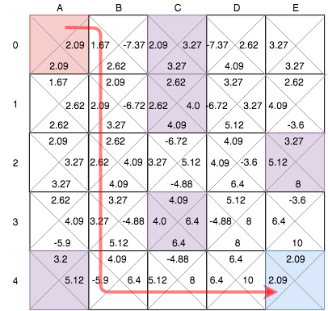

# 준비운동
간단한 문제를 Q-Learning을 통해 풀어보는 tutorial 입니다. 이미 RL 기본 컨셉에 대해서 알고 계셔야 하며, 혹시 모르신다면, [여기](https://medium.freecodecamp.org/an-introduction-to-reinforcement-learning-4339519de419)를 읽어 보실 것을 부탁 드립니다. 그리고 걱정 안 하셔도 됩니다. 이번 tutorial은 Neural Network를 사용하지 않는 간단한 예시니까요.
<br />
<br />
Mobile game Numero를 이 단계에서 바로 적용하기엔 난이도가 높을 것 같아서, 여기에선 Numero를 간단하게 변형해 보도록 하겠습니다. 아래와 같이 보드게임 판이 5 X 5로 있고, 우리의 목표는 출발점에서 목적지까지 도착하는 것입니다. 물론 그냥 가면 심심하니, 가는 길에 함정을 몇 개 파 넣도록 하겠습니다. 함정은 피해서 가도록 하는 것을 룰로 하겠습니다. 
<br />
<br />


## Q-Learning이란?
RL을 할 수 있는 approaches 중 하나는 Q-learning 입니다. 각각의 상황 별로 (`여기서 이렇게 하면` - `이렇게 된다`)를 정리해 놓은 테이블이라고 생각하시면 됩니다. 즉 (`state`, `action`) - (`value estimations`) 으로 표현됩니다. 
<br />
<br />
잘 안 와닿으시죠? 위 보드게임 판의 작은 타일 하나 하나 (A0, A1, A2, A3.... E4)가 각각 state라고 생각해 봅시다. 그리고 각 state에서 우리가 할 수 있는 움직임들(위, 아래, 오른쪽, 왼쪽으로 움직이기)이 action이라 정의를 해 봅니다. Q-learning에서 각 (s-a) pair 별 value를 계산한 다는 것은, 내가 어느 타일 위에 도착했을 경우, 위/아래/오른쪽/왼쪽으로 갔을 경우의 value를 미리 다 계산해 놓겠다는 거죠. 
<br />
<br />
사람은 딱 눈으로 봐도 대충 보이는 것들이 컴퓨터에게는 매우 힘이 드는 일이 됩니다. 예를 들어, 내가 B0이라는 타일에 도착 했을 때, 오른쪽으로 움직이는 것은 100% 자살행위라고 할 수 있죠 (C0 = Trap). 그러나 이렇게 눈으로 쉽게 보이는 것 외에, 사람도 약간 헷갈리는 경우의 수도 있을 수 있습니다. 예를 들어, 내가 A0에서 출발을 할 때, 오른쪽(B0)으로 움직이는 방법과  아래(A1)로 움직이는 방법 중 어느 action이 더 value가 높을 지는, 당장 숫자로 대답을 할 수 없습니다. 아무튼 이렇게 모든 타일에서의 모든 움직임에 대한 value를 계산하는 것이 바로 Q-learning입니다. 
<br />
<br />
이렇게 계산해서 뭘 하겠다는 건지? 그렇죠. 만약 모든 타일에서 모든 action에 대한 value가 있다면, 내가 어느 타일에 가던, 조금 더 value가 높은 방향으로 움직이면 되겠죠. 완벽한 컨닝 페이퍼는 아니지만, 마치 컨닝페이퍼 같은 역할을 하는 테이블이 될 것입니다. 
<br />
<br />
코딩으로 들어가기 전, 마지막으로 한가지 조건을 꾸역꾸역 넣어보겠습니다. 제가 위에 보여드린 이미지는 사람이 보기 편하라고 올려놓은 것입니다. 컴퓨터는 저런 그림을 줘도 모르니, 컴퓨터가 알아듣는 `numpy`의 array로 표현을 해야 하는 것입니다. 컴퓨터에게 보여주기 위해, state는 row로, action은 column으로 표현합니다.
<br />
(U = Up, D = Down, L = Left, R = Right, N = Nothing)
<br />
<br />

<br />

## Q-Learning
우리가 이제 할 일은 이 array matrix의 값을 구해보는 것입니다. 정신 없어지기 전에 우리가 해야 할 일을 적어 보겠습니다. 
1. Define parameters
1. Initialize Q-matrix by all zeros. 
1. For each episode. Select a random starting state. 
1. Select one among all possible actions for the current state (S).
1. Travel to the next state (S’) as a result of that action (a).
1. For all possible actions from the state (S’) select the one with the highest Q value.
1. Update Q-table using eqn.1.
1. Set the next state as the current state.
1. If goal state reached then end.

이제 프로세스 별로 자세하게 풀어보겠습니다. 자세한 코드는 모든 RL에 적용되는 것은 아니고, 여기 tutorial을 풀기 위한 과정입니다. 하지만 전체적은 흐름이나 필요한 요소는 비슷하니 다른 문제를 해결하실 때에 참고 + relevant한 코드만 취하실 것을 기억 해주세요. 
### Define parameters
RL에 등장하는 새 컨셉 중에 하나는 gamma 입니다. Discount factor인데, 먼 future reward를 가까운 future reward 대비 약간 discount를 해주는 역할을 합니다. Gamma가 크면, 먼 미래의 reward도 가까운 reward와 비슷하게 treat 하겠다는 의미, gamma가 작으면, 먼 미래의 reward는 가까운 미래의 reward 대비 가치 차이가 많이 난다는 것을 의미합니다. 
<br />
<br />
Episode는 쉽게 생각하셔서, 게임 한 판 이라고 보시면 됩니다. 우린 게임 1000판을 통해서 RL을 해볼 예정입니다. 
<br />
<br />
사실 RL에서 또 다루는 중요한 컨셉 중 alpha와 epsilon이 있지만, 준비운동이라는 핑계로 여기에서는 다루지 않겠습니다. 없어도 답은 나오니....참고로 alpha는 learning rate, epsilon은 공부 방법을 말합니다.
<br />
```python
gamma        = 0.8
num_episode  = 1000
```
### Define reward table, transition matrix, valid actions
이 부분은 이 문제 specific한 과정입니다. 위에 언급 했듯이, 컴퓨터는 게임판이니, 왼쪽이니, 오른쪽이니, 알아들을 수가 없어서 내가 미리 다 정의를 해줘야 합니다. 
#### reward table
이 테이블에서는 컴퓨터에게 각 state에서 U/D/L/R/N 의 action을 취했을 때에 어떤 reward를 받는지 정리해줍니다. 가장 마지막 row를 보면 `[0,0,0,0,10]`를 보실 수 있습니다. 위/아래/왼/오른쪽으로 가봤자 별 reward가 없지만, 그냥 그 자리에 가만히 있으면 reward가 10이란 뜻 입니다. 두 번째 row를 보시면 `[0,0,0,-10,0]` 이라고 되어 있는데, 이것은 위/아래/왼쪽으로 가면 별 이득이 없지만, 오른쪽으로 가면 -10 감점이 있다는 뜻입니다. 바로 옆 타일이 함정이니 -10 감점이라는 것이 말이 되겠네요. 이렇게 reward (가산점 또는 감점)을 통해 컴퓨터로 하여금 알아서 길을 찾아 가도록 만드는 것이 바로 RL의 핵심이라고 할 수 있겠습니다. 
<br />
```python
reward = np.array(
    [[ 0,  0,  0,  0,  0 ],
     [ 0,  0,  0,-10,  0 ],
     [ 0,  0,  0,  0,-10 ],
     [ 0,  0,-10,  0,  0 ],
     [ 0,  0,  0,  0,  0 ],
     [ 0,  0,  0,  0,  0 ],
     [ 0,  0,  0,-10,  0 ],
     [ 0,  0,  0,  0,-10 ],
     [ 0,  0,-10,  0,  0 ],
     [ 0,-10,  0,  0,  0 ],
     [ 0,  0,  0,  0,  0 ],
     [ 0,  0,  0,  0,  0 ],
     [ -10,-10,0,  0,  0 ],
     [ 0,  0,  0,-10,  0 ],
     [ 0,  0,  0,  0,-10 ],
     [ 0,-10,  0,  0,  0 ],
     [ 0,  0,  0,-10,  0 ],
     [ 0,  0,  0,  0,-10 ],
     [ 0,  0,-10,  0,  0 ],
     [-10,10,  0,  0,  0 ],
     [ 0,  0,  0,  0,-10 ],
     [ 0,  0,-10,  0,  0 ],
     [-10, 0,  0,  0,  0 ],
     [ 0,  0,  0, 10,  0 ],
     [ 0,  0,  0,  0, 10 ]]
)
```
다른 해외 tutorial들을 참고할 때, [OpenAI](https://gym.openai.com/)를 사용하거나 아주 작은 경우의 수를 쓰던데, 그 이유를 알겠더군요. 제가 만든 예시의 경우의 수가 25 * 5 (= 125)인 것이 갑자기 고통으로 다가오고 있습니다.

#### transition table
컴퓨터에게 또 알려줘야 할 것이 있습니다. 어느 state에서 위/아래/왼/오른쪽으로 움직였을때에 next tile이 무엇인지 말해줘야 합니다. 우리가 array로 문제를 바꾸었기 때문인데요, 이쯤 되면 왜 하지 싶습ㄴ... 그러나 우린 준비운동 중이므로 열심히 쓰도록 하겠습니다. 
첫 번째 row `[-1, 5, -1, 1, 0]`의 의미는, 위로는 못 가고 (-1), 아래로 내려가면 5번째 array로 가고 (aka state 6), 왼쪽으로는 못 가고 (-1), 오른쪽으로 가면 1번째 array로 가고 (aka state 2), 그리고 가만히 있으면 그냥 자기 자신 (0번째 array)에게 머문다는 의미 입니다. 
<br />
```python
transition_matrix = np.array(
    [[ -1, 5 , -1,  1,  0 ],
     [ -1, 6 ,  0,  2,  1 ],
     [ -1, 7 ,  1,  3,  2 ],
     [ -1, 8 ,  2,  4,  3 ],
     [ -1, 9 ,  3, -1,  4 ],
     [ 0 , 10, -1,  6,  5 ],
     [ 1 , 11,  5,  7,  6 ],
     [ 2 , 12,  6,  8,  7 ],
     [ 3 , 13,  7,  9,  8 ],
     [ 4 , 14,  8, -1,  9 ],
     [ 5 , 15, -1, 11, 10 ],
     [ 6 , 16, 10, 12, 11 ],
     [ 7 , 17, 11, 13, 12 ],
     [ 8 , 18, 12, 14, 13 ],
     [ 9 , 19, 13, -1, 14 ],
     [ 10, 20, -1, 16, 15 ],
     [ 11, 21, 15, 17, 16 ],
     [ 12, 22, 16, 18, 17 ],
     [ 13, 23, 17, 19, 18 ],
     [ 14, 24, 18, -1, 19 ],
     [ 15, -1, -1, 21, 20 ],
     [ 16, -1, 20, 22, 21 ],
     [ 17, -1, 21, 23, 22 ],
     [ 18, -1, 22, 24, 23 ],
     [ 19, -1, 23, -1, 24 ]]
)
```
#### valid_actions
믿기지 않겠지만, 마지막으로 컴퓨터에게 알려줘야 할 것이 있습니다. 각 state에서 위/아래/왼/오른쪽 중 어느 방향으로 갈 수 있는지 입니다. 솔직히 이번거는 전혀 힘들지 않고, 할 만 하네요. valid actions 인코딩은 다음과 같습니다. 
<br />
`up = 0` <br />
`down = 1` <br />
`left = 2` <br />
`right = 3` <br />
`no action = 4` <br />

```python
valid_actions = np.array(
    [[ 1, 3, 4 ],
     [ 1, 2, 3, 4 ],
     [ 1, 2, 3, 4 ],
     [ 1, 2, 3, 4 ],
     [ 1, 2, 4 ],
     [ 0, 1, 3, 4 ],
     [ 0, 1, 2, 3, 4 ],
     [ 0, 1, 2, 3, 4 ],
     [ 0, 1, 2, 3, 4 ],
     [ 0, 1, 2, 4 ],
     [ 0, 1, 3, 4 ],
     [ 0, 1, 2, 3, 4 ],
     [ 0, 1, 2, 3, 4 ],
     [ 0, 1, 2, 3, 4 ],
     [ 0, 1, 2, 4 ],
     [ 0, 1, 3, 4 ],
     [ 0, 1, 2, 3, 4 ],
     [ 0, 1, 2, 3, 4 ],
     [ 0, 1, 2, 3, 4 ],
     [ 0, 1, 2, 4 ],
     [ 0, 3, 4 ],
     [ 0, 2, 3, 4 ],
     [ 0, 2, 3, 4 ],
     [ 0, 2, 3, 4 ],
     [ 0, 2, 4 ]]
)
```
#### populate matrix
이제 컴퓨터에게 일을 시킬 차례입니다. 무식한 방법으로 하겠습니다. 컴퓨터에게 1000번 동안 게임팜을 돌면서, 모든 경우의 수에 대한 reward를 계산하라고 할 것입니다. 
```python
# 일단 0으로 채워진 q_matirx를 만듭니다. 이 q_matrix 0 값을 업데이트 할 예정입니다. 
q_matrix = np.zeros((25,5))

for i in range(num_episode):
    start_state = 0                                                            # 우리의 시작은 무조건 0번 부터. 문제자의 마음이며, 0번 시작으로 고정이 싫으시다면, 여기도 랜덤으로 바꾸셔도 됩니다.
    curr_state  = start_state
    while curr_state  != finish_state:                                         # 24th array(25번째 타일)에 도착하는 순간 instance가 끝이 납니다. 이 값을 안 정하면, 절대 게임이 안 끝나겠죠.
        action         = random.choice(valid_actions[curr_state])              # valid actions 테이블을 보고, 아무 방향이나 랜덤으로 고른 뒤 (예를 들어 <아래> 라고 해봅시다),
        next_state     = transition_matrix[curr_state][action]                 # 그 랜덤 방향(예를 들어 <아래>)으로 갔을 때, 어느 타일 (next state)에 도달하는지 볼까? 
        future_rewards = []
        for action_nxt in valid_actions[next_state]:                           # next state에서 가능한 모든 뱡향이 주는 
            future_rewards.append(q_matrix[next_state][action_nxt])            # rewards를 일단 다 구한 담에
        q_state = reward[curr_state][action] + gamma * max(future_rewards)     # 그 중 가장 큰 값에 gamma를 곱한 뒤에, 기존에 있던 reward 테이블에 있던 값과 더한 값을  
        q_matrix[curr_state][action] = q_state                                 # 현재 tile에서 내가 고른 그 아무 방향에(예를 들어 <아래>) 대한 reward라고 기록을 하자
        curr_state = next_state                                                # 자 다음!

```
### Final Q-table
눈깜짝 할 사이에 결과가 나왔습니다. 
```python
Final q-matrix:
[[ 0.         2.097152   0.         2.097152   1.6777216]
 [ 0.         2.62144    1.6777216 -7.37856    2.097152 ]
 [ 0.         3.2768     2.097152   3.2768    -7.37856  ]
 [ 0.         4.096     -7.37856    2.62144    3.2768   ]
 [ 0.         3.2768     3.2768     0.         2.62144  ]
 [ 1.6777216  2.62144    0.         2.62144    2.097152 ]
 [ 2.097152   3.2768     2.097152  -6.7232     2.62144  ]
 [ 2.62144    4.096      2.62144    4.096     -6.7232   ]
 [ 3.2768     5.12      -6.7232     3.2768     4.096    ]
 [ 2.62144   -3.6        4.096      0.         3.2768   ]
 [ 2.097152   3.2768     0.         3.2768     2.62144  ]
 [ 2.62144    4.096      2.62144    4.096      3.2768   ]
 [-6.7232    -4.88       3.2768     5.12       4.096    ]
 [ 4.096      6.4        4.096     -3.6        5.12     ]
 [ 3.2768     8.         5.12       0.        -3.6      ]
 [ 2.62144   -5.904      0.         4.096      3.2768   ]
 [ 3.2768     5.12       3.2768    -4.88       4.096    ]
 [ 4.096      6.4        4.096      6.4       -4.88     ]
 [ 5.12       8.        -4.88       8.         6.4      ]
 [-3.6       10.         6.4        0.         8.       ]
 [ 3.2768     0.         0.         5.12      -5.904    ]
 [ 4.096      0.        -5.904      6.4        5.12     ]
 [-4.88       0.         5.12       8.         6.4      ]
 [ 6.4        0.         6.4       10.         8.       ]
 [ 0.         0.         0.         0.         0.       ]]
```
두번째 row의 값이 `[ 0., 2.62144,1.6777216,-7.37856,2.097152 ]`인데 아래와 같이 풀이됩니다. 
* 위로 가면: value가 0
* 아래로 가면: value가 2.62
* 왼쪽으로 가면: value가 1.67
* 오른쪽으로 가면: value가 -7.37 (<-- 이건 당연하죠. 바로 오른쪽에 함정이 있으니까요)
이제 모든 action에 대한 value가 나왔으니, 우리가 이제 할 일은 좀 더 큰 value가 있는 방향으로 가면 되는 것입니다! 아래와 같이 말이죠 :)



위 코드는 `simple_qtable.py`에서 확인 부탁 드립니다. 만약 epsilon, alpha를 모두 사용한 코드를 보시고 싶으시다면 `simple_qtable_complete.py`를 확인 부탁 드립니다. 

### Source
* [An introduction to Reinforcement Learning](https://medium.freecodecamp.org/an-introduction-to-reinforcement-learning-4339519de419)
* [Reinforcement Learning with Q tables](https://itnext.io/reinforcement-learning-with-q-tables-5f11168862c8)
* [Introduction to Q-Learning](https://towardsdatascience.com/introduction-to-q-learning-88d1c4f2b49c)
 