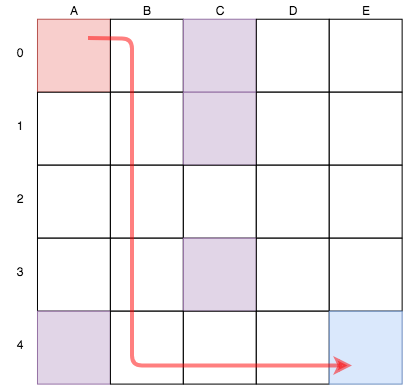

# Solving Q-table using Neural Network
1_Intro에서 다루었던 [Q-table 예시](https://github.com/doranbae/reinforcementLearning_oremun/blob/master/1_Intro/README_1.md)를 neural network를 통해 풀어보겠습니다. 이미 RL 기본 컨셉에 대해서 알고 계셔야 하며, 혹시 모르신다면, [여기](https://medium.freecodecamp.org/an-introduction-to-reinforcement-learning-4339519de419)를 먼저 읽어 보실 것을 부탁 드립니다.

## Why neural netork?
이전 단계를 모두 읽어 보셨다면, 이 tutorial의 목표, Q-learning에 대해서 감이 오실 것입니다. [1_Intro](https://github.com/doranbae/reinforcementLearning_oremun/blob/master/1_Intro/README_1.md)에서는 `numpy` array update를 통하여 q-table을 populate했었습니다. 이 방법으로 해도, 보기 괜찮은 답이 나왔는데, 왜 neural network을 사용하는 것이 좋은지, 어느 때에 사용해야 하는지를 생각 해보겠습니다. 
<br />
<br />
RL은 optimization 문제를 풀 때 사용되는 기법입니다. 프로그램은 각 상황 별로 가장 좋은(optimal) action을 취하는 방법을 배우는 것입니다. 보통 이 상황(state) 경우의 수가 아주 큰 케이스( > 1000)에 RL을 사용하게 됩니다. 이렇게 state 수가 많은 stochastic structure에서는 closed form analysis를 하기엔 적합하지 않기 때문이죠. 사실 state 수가 적다면, RL이 아닌, dynamic programming을 사용하는 것도 방법입니다. Q-learning의 핵심 아이디어는 각 state-action pair별로 value 값을 구해 저장을 하는 것인데, 이전 단계처럼, pair 숫자가 작은 경우엔 neural network를 안 사용하고도 답을 구할 수 있습니다. 그런데, 이 state-action pair가 굉장히 많다면, q-matrix를 구하기가 매우 어려워질 것입니다. 바로 이 이유 때문에 neural network를 사용합니다. Neural network은 보통 batch-update과 incremental-update 방법이 있습니다. Batch-update는 모든 데이터를 한꺼번에 요구하는데, RL는 매 state별로 neural network 업데이트를 하는 것이므로, incremental-update이 더 적합하겠죠.

#### Define parameters
```python
alpha        = 0.95
epsilon      = 0.5
gamma        = 0.999
num_episodes = 100
finish_state = 24
```
#### Define reward table, transition matrix, valid actions
이 부분은 1_Intro directory를 참고 부탁 드립니다. 

## Train neural network to perform Q-learning
Keras를 사용해보도록 하겠습니다. 모델의 첫번째 layer에서는 InputLayer를 사용하여 batch_input_shape를 define 합니다. 두 번째 layer는 50개의 node를 갖은 hidden layer, 그리고 마지막 output layer에서는 5가지 action에 대한 likely를 구할 수 있도록 shape을 5로 정했습니다. 

```python
import numpy as np
import random
from keras.models import Sequential
from keras.layers import Dense
from keras.layers import InputLayer

def qtable_nn_model():
    # build model
    model = Sequential()
    model.add(InputLayer(batch_input_shape = (1, 25)))
    model.add(Dense( 50, activation='sigmoid' ))
    model.add(Dense( 5, activation='linear' ))

    # compile model
    model.compile(loss = 'mse', optimizer='adam', metrics=['mae'])
    return model

model = qtable_nn_model()
```
### Start train
```python
for i in range(num_episodes):
    curr_state = 0                               # 모든 게임의 시작은 0번 칸부터 시작합니다.
    epsilon   *= gamma                           # epsilon 값을 define 합니다.
    if i % 10 == 0:
        print('Episode {} of {}'.format(i + 1, num_episodes))
    r_sum = 0
    while curr_state != finish_state:                             # 게임이 끝나지 않은 상태에서
        if random.uniform(0,1) < epsilon:                         # Exploit을 할 지, explore를 할 지 정합니다. 
            action = random.choice(valid_actions[curr_state])     # Explore를 하는 경우
        else:
                                                                  # Exploit을 하는 경우
            all_actions_candi  = model.predict( np.identity(25)[ curr_state : curr_state + 1 ])                                          # 이 tutorial specific한 프로세스입니다. 모든 action 중...
            valid_actions_candi= [x if transition_matrix[curr_state][idx] != -1 else -10 for idx, x in enumerate(all_actions_candi[0])]  # 취할 수 있는 action을 추려낸 뒤, (예를 들어, state 1번에서 위로 가기는 안 되죠..) 
            action             = np.argmax(valid_actions_candi)                                                                          # 그 중 가장 큰 값을 구합니다. 

        next_state = transition_matrix[curr_state][action]    # Next state에서
        r          = reward[curr_state][action]               # target은 지금 reward r 더하기

        target             = r + alpha * np.max( model.predict(np.identity(25)[next_state : next_state + 1 ]) )    # Next state에서 기대되는 reward (<-- Neural network로 predict 합니다.)
        target_vec         = model.predict( np.identity(25)[curr_state: curr_state + 1] )[0]
        target_vec[action] = target                                                                                # 내가 취한 action에 대해서만 값을 업데이트 합니다.

        model.fit(np.identity(25)[curr_state: curr_state + 1] , target_vec.reshape(-1, 5), epochs = 10, verbose = 0)
        curr_state = next_state
        r_sum     += r
    q_avg_list.append(r_sum / 1000)

```
### Evaluate result
Neural network 모델에게, state 1 ~ 25 중 하나를 주었을때, 각 action에 대한 Q-learning 값을 무엇으로 주는 지 보도록 하겠습니다.
```python
Evaluation
 
state 2: right is trap
[[26.447155 28.258606 25.797613 14.817667 24.483923]]

state 23: right is finish
[[34.58911  33.87501  32.91646  38.244846 33.406757]]

state 13: up and bottom is trap
[[23.458178 22.426283 29.204704 27.59669  25.395016]]

state 20: up is trap and bottom is finish
[[27.518227 35.016026 28.784143 26.829842 26.236578]]

Process finished with exit code 0
```
state 13에 대한 q-learning 값을 불렀더니, `[23.458178, 22.426283, 29.204704, 27.59669,  25.395016]`가 나왔습니다. 
* expected reward of going up      : 23.45 <-- 위에 trap이 있으니 이 숫자가 낮은 것이 말이 됩니다.
* expected reward of going down    : 22.42 <-- 아래에 trap이 있으니 이 숫자가 낮은 것이 말이 됩니다.
* expected reward of going left    : 29.20
* expected reward of going right   : 27.59 
* expected reward of doing nothing : 25.39

비슷하게, state 20에 대한 q-learning 값을 불러봅니다. 
* expected reward of going up      : 27.51 <-- 위에 trap이 있으니 이 숫자가 낮은 것이 말이 됩니다.
* expected reward of going down    : 35.01 <-- 아래에 finish가 있으니 이 숫자가 높은 것이 말이 됩니다.
* expected reward of going left    : 28.78
* expected reward of going right   : 26.82 <-- 오른쪽으로 가지 못하니 이 숫자가 낮은 것이 말이 됩니다.
* expected reward of doing nothing : 26.23

마지막으로 어느 타일을 밟아 가면 좋을지 neural network를 통해 알아보도록 하겠습니다. 

```python
start = 0
finish = 24
curr_path = start
best_path = [start]

while curr_path != finish:
    best_action = np.argmax(model.predict(np.identity(25)[curr_path: curr_path + 1]))
    next_path   = transition_matrix[curr_path][best_action]
    best_path.append(next_path)
    curr_path = next_path

print(best_path)
```

이렇게 나오는군요!
<br />
```python
[0, 1, 6, 11, 16, 21, 22, 23, 24]
```

<br />
위 코드는 `simple_qtable_nn.py`에서 확인 부탁 드립니다.

### Source
* [Adventures in machine Learning](http://adventuresinmachinelearning.com/reinforcement-learning-tutorial-python-keras/)
* [Missouri University of Science & Technology, \<Neural Networks And Reinforcement Learning> by Abhijit Gosavi](http://web.mst.edu/~gosavia/neural_networks_RL.pdf)